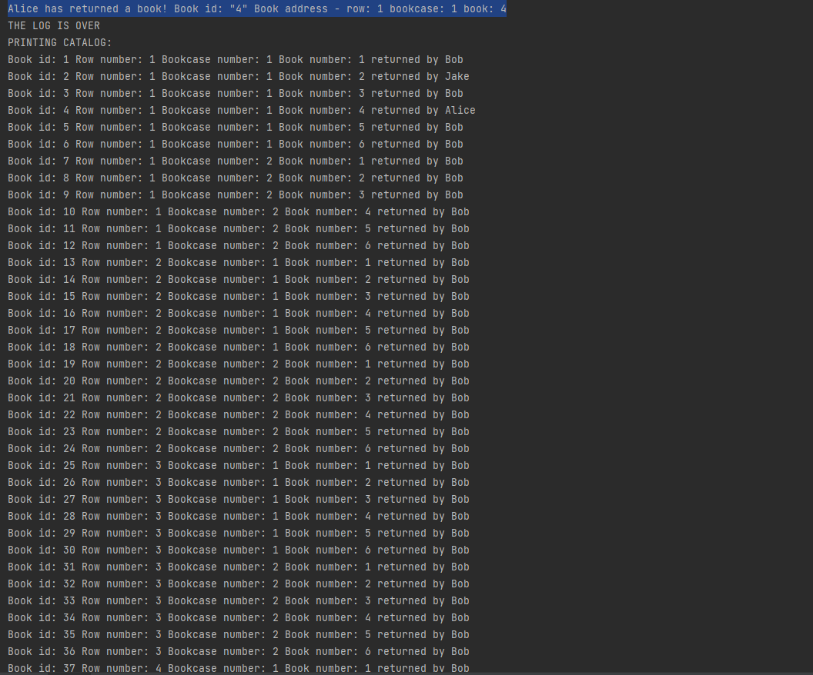

# Результаты тестов:
**Примичание:** Программа выводит лог о проделанной работе в консоль, но не записывает его в файл, т.к. это бессмысленно. 
### тест № 1 консольный ввод:
Входные даннные: 3 3 3
 
 
 Вывод в файл:
 
### тест № 2 файловый ввод:
Входные данные: 3 2 4
  Аргументы командной строки:
 
  Файл с входными данными
 
  Вывод результата работы программы в консоль. Обратите внимание, что программа распознала режим ввода и верно определила количество аргументов.
 
 
  Вывод результата работы программы в файл:
 
### тест № 3 ввод через аргументы командной строки:
Входные даннные: 2 5 2
  Аргументы командной строки:
 
  Вывод результата работы программы в консоль.
 
 
  Т.к. в этом режиме ввода, пользователь сразу не вводит файл для вывода данных, в конце работы программы, приложение спрашивает, желает ли пользователь записать данные в файл. Мы ввели имя файла для вывода, вот, что программа туда записала:
 
### тест № 4 рандомная генерация входных данных:
  Аргументы командной строки:
 
  Вывод результата работы программы в консоль.
 
 
 
 
  Вывод результата работы программы в файл:
 
 
### Что если ввести некорректные значения M N K?
 
### Вердикт
В ходе проверки использовались самые разные данные, программа корректно отработала во всех случаях со всеми режимами ввода. Вывод **католога** в консоль совпадает с выводом католога в файл (как уже писалось ранее, программа дополнительно выводит лог работы перед каталогом в консоль).
### Тестовые файлы
 тест1(https://github.com/mperestoronin/Computer-Architecture-HW4/blob/main/testfiles/test1output.txt)
 тест2 [input](https://github.com/mperestoronin/Computer-Architecture-HW4/blob/main/testfiles/test2input.txt) [output](https://github.com/mperestoronin/Computer-Architecture-HW4/blob/main/testfiles/test2output.txt)
 [тест3](https://github.com/mperestoronin/Computer-Architecture-HW4/blob/main/testfiles/test3output.txt)
 [тест4](https://github.com/mperestoronin/Computer-Architecture-HW4/blob/main/testfiles/test4output.txt)
 а также [тест](https://github.com/mperestoronin/Computer-Architecture-HW4/blob/main/testfiles/output.txt) на 1000 книг (входные данные 10 10 10)
